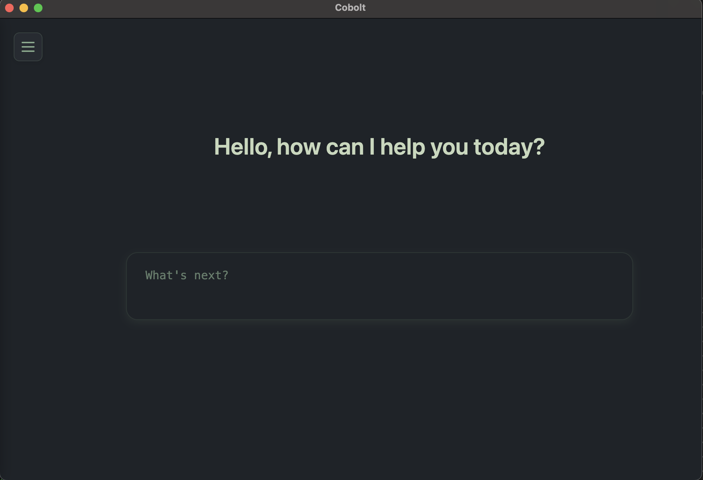
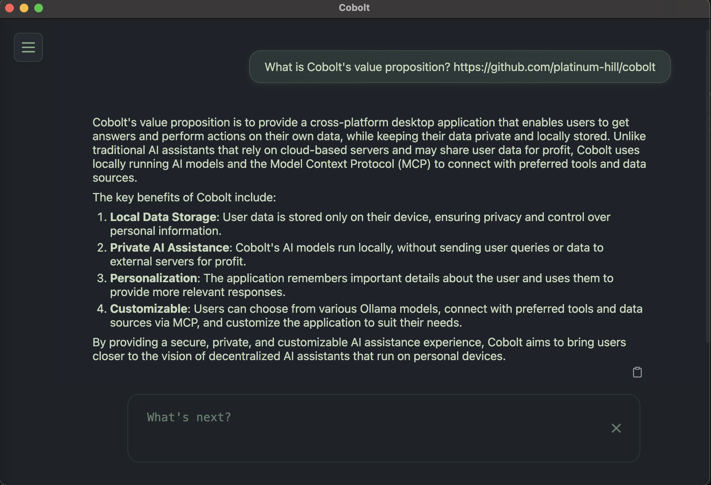
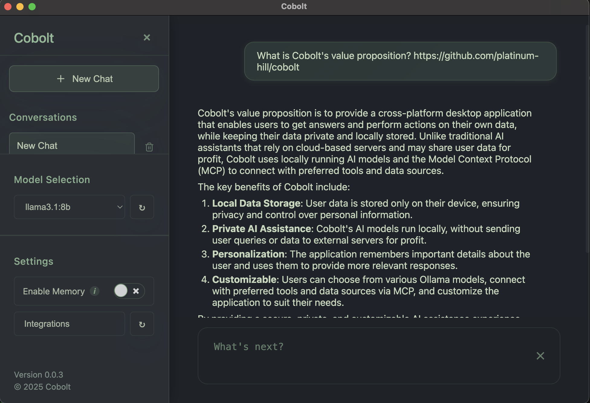
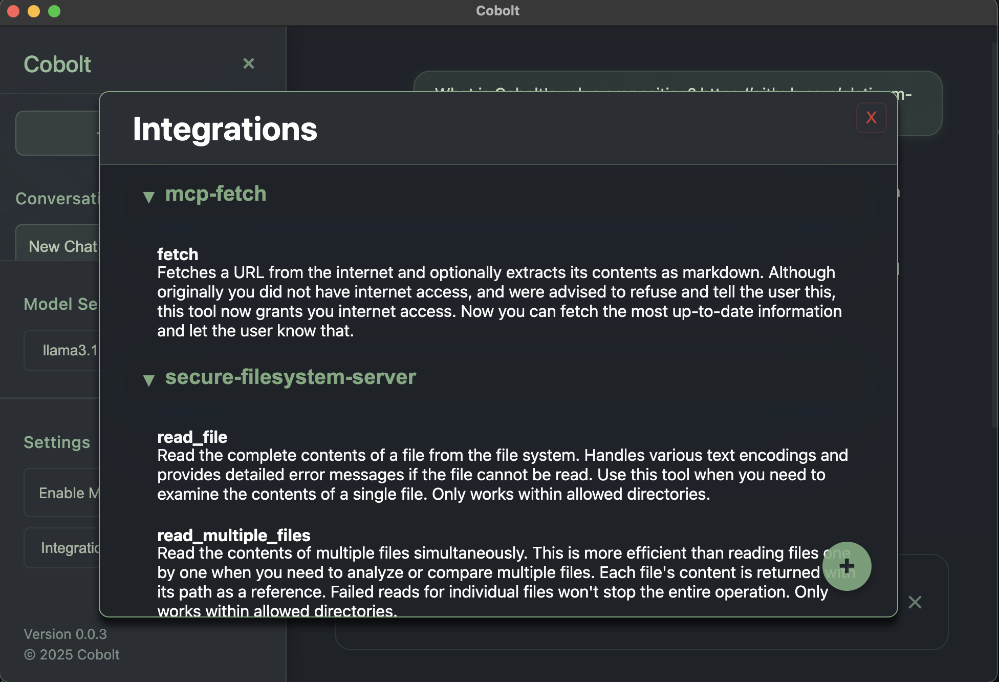

# Cobolt

<div align="center">
  
  
  [](https://opensource.org/licenses/Apache-2.0)
  [](#)
  [](#)
  [](https://github.com/platinum-hill/cobolt/releases)
  [](https://github.com/platinum-hill/cobolt/actions/workflows/build.yml)
  [](https://github.com/platinum-hill/cobolt/actions/workflows/release.yml)
</div>

<div align="center">
  <h3>📥 Download Latest Release</h3>
  
  [](https://github.com/platinum-hill/cobolt/releases/download/v0.0.4/Cobolt-0.0.3.dmg)
  [](https://github.com/platinum-hill/cobolt/releases/download/v0.0.4/Cobolt-Setup-0.0.3.exe)
  
  <sub>This is an early release which is expected to be unstable and change significantly over time.
  For other platforms and previous versions, visit our [Releases](https://github.com/platinum-hill/cobolt/releases) page</sub>
</div>

## 🎯 Overview

Cobolt is a cross-platform desktop application that enables you to get answers, and perform actions on the data that matters to you. Cobolt only stores data on your device, and uses locally running AI models. Cobolt can also remembers important details about you, and use it to give you personalized responses.And yes! your memories are stored on your device.
You can connect to your favourite tools and data sources using the [Model Context Protocol (MCP)](https://modelcontextprotocol.io/introduction).

Feel like every query to a big tech AI is an automatic, non-consensual donation to their 'Make Our AI Smarter' fund, with zero transparency on how your 'donation' is used on some distant server farm? 💸🤷

We believe that the AI assistants of the future will run on your device, and will not send your data, or queries to be used by tech companies for profit. 
Small language models are closing the gap with their larger counterparts, and our devices are becoming more powerful. Cobolt is our effort to bring us closer to that future.

Cobolt enables you to get answers based on your data, with a model of your choosing.

<div align="center">
  
  
  <br>
  
  
</div>

## Key Differentiators

- Local Models: Ensures that your data does not leave your device. We are powered by Ollama, which enables you to use the open source model of your choosing.  
- Model Context Protocol Integration: Enables you to connect to the data sources, or tools that matter the most to you using MCP. This enables your model to access relevant tools and data, providing more useful, context aware responses.
- Native Memory Support: Cobolt remembers the most important things about you, and uses this to give you more relevant responses.

## Getting Started
To get started, you'll need the appropriate package manager installed on your system.

### MacOS
On macOS, Homebrew is used to install dependencies. Ensure Homebrew is installed. To install it, run the following command in the Terminal:
`/bin/bash -c "$(curl -fsSL https://raw.githubusercontent.com/Homebrew/install/HEAD/install.sh)"`

### Windows 
On Windows, Winget (the Windows Package Manager) is utilized.
If you need to install Winget is available using PowerShell, run the following command as an administrator:
`Install-Module -Name Microsoft.WinGet.Client -Repository PSGallery -Confirm:$false -AllowClobber; Repair-WinGetPackageManager;`

You can confirm winget is present using powershell with 
`winget -v`

## How to?

### How to change the model?
By default we use [llama3.1:8b](https://ollama.com/library/llama3.1:8b) for inference, and [nomic-embed-text](https://ollama.com/library/nomic-embed-text) for embedding.

You can use any Ollama model that supports tool calls listed [here](https://ollama.com/search?c=tools). 
To download a new model for inference install it from Ollama

```bash
ollama ls # to view models
ollama pull qwen3:8b # to download qwen3:8b
```

The downloaded model can be selected from the settings section on the app.

> **Note:** If you want additional customization, you can update the models for tool use, inference, or embedding models individually:
> 
> On Windows: Edit `%APPDATA%\cobolt\config.json` 
> 
> On macOS: Edit `~/Library/Application Support/cobolt/config.json`
>
> On Linux: Edit `$HOME/.config/cobolt/config.json`
> 
> After editing, restart Cobolt for changes to take effect.


### How to add new integrations?
You can find the most useful [MCP backed integrations here](https://github.com/modelcontextprotocol/servers). Add new MCP servers by adding new integrations through the application. The application will direct you to a JSON file to add your MCP server. We use the same format as Claude Desktop to make it easier for you to add new servers.

Some integrations that we recommend for new users are available at [sample-mcp-server.json](https://github.com/platinum-hill/cobolt/blob/main/sample-mcp-servers.json).

Restart the application, or reload the integrations after you have added the required servers.


## 🤝 Contributing

Contributions are welcome! Whether it's reporting a bug, suggesting a feature, or submitting a pull request, your help is appreciated. 

Please read our [Contributing Guidelines](CONTRIBUTING.md) for details on how to setup your development environment and contribute to Cobolt.

You can also:
* [Report a Bug](https://github.com/platinum-hill/cobolt/issues/new?assignees=&labels=bug&template=bug_report.md&title=)
* [Request a Feature](https://github.com/platinum-hill/cobolt/issues/new?assignees=&labels=enhancement&template=feature_request.md&title=)
## 📄 License

This project is licensed under the Apache 2.0 License - see the [LICENSE](LICENSE) file for details.

## Acknowledgements

Cobolt builds upon several amazing open-source projects and technologies:

- [Ollama](https://ollama.ai/) - The powerful framework for running large language models locally
- [Model Context Protocol](https://github.com/anthropic/model-context-protocol) - The protocol specification by Anthropic for model context management
- [Mem0](https://github.com/mem0ai/mem0) - The memory management system that inspired our implementation
- [Electron](https://www.electronjs.org/) - The framework that powers our cross-platform desktop application

We're grateful to all the contributors and maintainers of these projects for their incredible work.

---

<div align="center">
  <sub>Built with ❤️ by the Cobolt team</sub>
</div>
